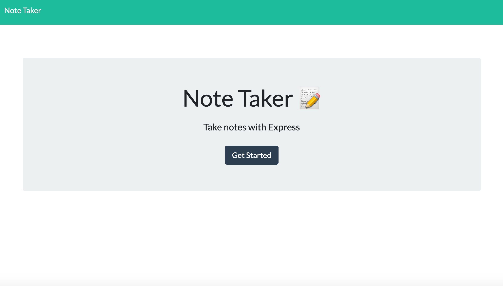
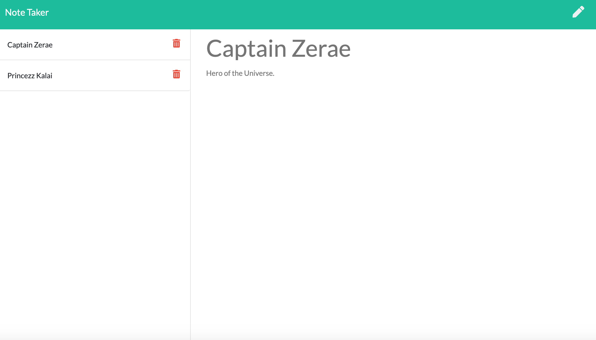

# Mi-Notes
Mi Notes is an app that helps you write the notes you need to make your day a better and more thoughtful one.

## Project Details

Welcome to Mi-Notes! 

Mi-Notes is an application that lets you write, store, and delete notes, all at the touch of a button. It was created using API and HTML routes, which linked the database to the UI and lets the user write and save notes. Get, post, and delete methods were used to dynamically connect the frontend and backend. The server was created using JavaScript and Express, listening locally on Port 3001. The project was deployed to Heroku for easy access to all. We hope that you enjoy! 

Thanks for stopping in! I look forward to working together to make the present and future a better place.

## Application

Mi Notes: https://mi-notes-mw.herokuapp.com/

## Build Details

This application was developed using: Express, Node.js, API/HTML routes, JavaScript, HTML, CSS, and more! 

## Repository & Preview

View the repository at: https://github.com/MichaelWitt/Mi-Notes

Preview: 
Demo: 

## Updates

You can find project updates in the repository, highlighting what was done to create the final product.

https://github.com/MichaelWitt/Mi-Notes/commits/

## Credits

UNC Coding Bootcamp And Trilogy for the inspiration! 

Thanks! 

## Thanks For Visiting!

Come back soon :)
